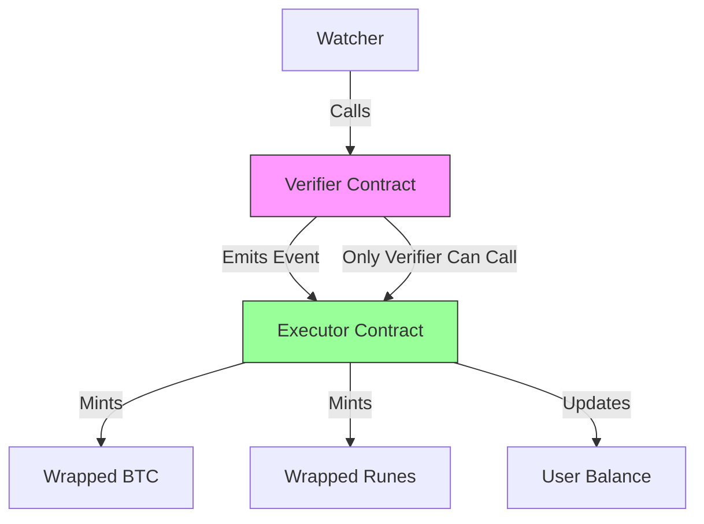

# Phase 4: The Executor - Implementation Plan

> **Goal**: Build the L2 Executor contract that mints assets and triggers business logic based on verified Bitcoin transactions.

---

## 📋 Overview

The Executor is the **final step** in the Rift pipeline. Once the Verifier confirms a Bitcoin transaction's validity, the Executor:

1. **Mints wrapped assets** (Runes, Ordinals, BTC)
2. **Updates user balances** on Starknet
3. **Triggers downstream logic** (DEX swaps, gaming state, DeFi positions)

```
Bitcoin L1 → Watcher → Verifier → Executor → User receives L2 assets
                                    ↓
                            (Instant execution)
```

---

## 🏗️ Architecture

### Component Relationship



### Design Pattern: Verifier-Executor Separation

**Why separate Verifier and Executor?**

| Aspect | Verifier | Executor |
|--------|----------|----------|
| **Responsibility** | Cryptographic verification | Business logic execution |
| **Security** | High (crypto-critical) | Medium (logic-dependent) |
| **Upgradeability** | Rare/Seldom | Frequent (business rules change) |
| **Gas Cost** | Optimized for verification | Optimized for state changes |

**Benefits**:
- ✅ **Single Responsibility**: Each contract does one thing well
- ✅ **Upgradeability**: Can update Executor without touching Verifier
- ✅ **Reusability**: Multiple Executors can use same Verifier
- ✅ **Security Isolation**: Crypto logic separate from business logic

---

## 🎯 Implementation Steps

### Step 1: Define Executor Interface

**File**: `contracts/src/executor.cairo`

```cairo
use starknet::ContractAddress;

#[starknet::interface]
pub trait IExecutor<TContractState> {
    // Mint wrapped BTC based on verified Bitcoin transaction
    fn mint_wrapped_btc(
        ref self: TContractState,
        recipient: ContractAddress,
        amount: u256,
        bitcoin_tx_hash: felt252
    );
    
    // Mint wrapped Runes
    fn mint_wrapped_runes(
        ref self: TContractState,
        recipient: ContractAddress,
        rune_id: u256,
        amount: u256,
        bitcoin_tx_hash: felt252
    );
    
    // Get user balance
    fn get_balance(self: @TContractState, user: ContractAddress) -> u256;
    
    // Withdraw/burn wrapped tokens to claim underlying Bitcoin
    fn burn_and_withdraw(
        ref self: TContractState,
        user: ContractAddress,
        amount: u256,
        bitcoin_output_script: felt252
    );
}
```

---

### Step 2: Implement Executor Contract

**File**: `contracts/src/executor.cairo` (implementation)

```cairo
#[starknet::contract]
pub mod Executor {
    use starknet::{ContractAddress, get_caller_address, storage::Map};
    use rift_verifier::verifier::IVerifierDispatcher;

    #[storage]
    struct Storage {
        // The Verifier contract (only it can call executor)
        verifier: ContractAddress,
        
        // User balances (wrapped BTC)
        wrapped_btc_balances: Map<ContractAddress, u256>,
        
        // User balances (wrapped Runes by rune_id)
        wrapped_runes_balances: Map<(ContractAddress, u256), u256>,
        
        // Track minted Bitcoin transactions to prevent double-claim
        claimed_transactions: Map<felt252, bool>,
        
        // Total supply
        total_wrapped_btc: u256,
    }

    #[event]
    #[derive(Drop, starknet::Event)]
    pub enum Event {
        WrappedBTCMinted: WrappedBTCMintedEvent,
        WrappedRunesMinted: WrappedRunesMintedEvent,
        BurnedAndWithdrawn: BurnedAndWithdrawnEvent,
    }

    #[derive(Drop, starknet::Event)]
    pub struct WrappedBTCMintedEvent {
        #[key]
        pub recipient: ContractAddress,
        pub amount: u256,
        pub bitcoin_tx_hash: felt252,
    }

    #[derive(Drop, starknet::Event)]
    pub struct WrappedRunesMintedEvent {
        #[key]
        pub recipient: ContractAddress,
        #[key]
        pub rune_id: u256,
        pub amount: u256,
        pub bitcoin_tx_hash: felt252,
    }

    #[derive(Drop, starknet::Event)]
    pub struct BurnedAndWithdrawnEvent {
        #[key]
        pub user: ContractAddress,
        pub amount: u256,
        pub bitcoin_output_script: felt252,
    }

    #[constructor]
    fn constructor(ref self: ContractState, verifier: ContractAddress) {
        self.verifier.write(verifier);
    }

    #[abi(embed_v0)]
    impl ExecutorImpl of super::IExecutor<ContractState> {
        fn mint_wrapped_btc(
            ref self: ContractState,
            recipient: ContractAddress,
            amount: u256,
            bitcoin_tx_hash: felt252
        ) {
            // 1. Only Verifier can call
            assert(get_caller_address() == self.verifier.read(), 'Only verifier can call');
            
            // 2. Check transaction not already claimed
            assert(!self.claimed_transactions.read(bitcoin_tx_hash), 'Already claimed');
            
            // 3. Mark as claimed
            self.claimed_transactions.write(bitcoin_tx_hash, true);
            
            // 4. Mint wrapped BTC
            let current_balance = self.wrapped_btc_balances.read(recipient);
            self.wrapped_btc_balances.write(recipient, current_balance + amount);
            
            // 5. Update total supply
            let total = self.total_wrapped_btc.read();
            self.total_wrapped_btc.write(total + amount);
            
            // 6. Emit event
            self.emit(Event::WrappedBTCMinted(WrappedBTCMintedEvent {
                recipient: recipient,
                amount: amount,
                bitcoin_tx_hash: bitcoin_tx_hash,
            }));
        }

        fn mint_wrapped_runes(
            ref self: ContractState,
            recipient: ContractAddress,
            rune_id: u256,
            amount: u256,
            bitcoin_tx_hash: felt252
        ) {
            // Similar to mint_wrapped_btc but for Runes
            // Only Verifier can call
            assert(get_caller_address() == self.verifier.read(), 'Only verifier can call');
            
            // Check not already claimed
            assert(!self.claimed_transactions.read(bitcoin_tx_hash), 'Already claimed');
            
            // Mark as claimed
            self.claimed_transactions.write(bitcoin_tx_hash, true);
            
            // Mint wrapped Runes
            let key = (recipient, rune_id);
            let current_balance = self.wrapped_runes_balances.read(key);
            self.wrapped_runes_balances.write(key, current_balance + amount);
            
            // Emit event
            self.emit(Event::WrappedRunesMinted(WrappedRunesMintedEvent {
                recipient: recipient,
                rune_id: rune_id,
                amount: amount,
                bitcoin_tx_hash: bitcoin_tx_hash,
            }));
        }

        fn get_balance(self: @ContractState, user: ContractAddress) -> u256 {
            self.wrapped_btc_balances.read(user)
        }

        fn burn_and_withdraw(
            ref self: ContractState,
            user: ContractAddress,
            amount: u256,
            bitcoin_output_script: felt252
        ) {
            // 1. Check caller is the user
            assert(get_caller_address() == user, 'Not your funds');
            
            // 2. Check sufficient balance
            let balance = self.wrapped_btc_balances.read(user);
            assert(balance >= amount, 'Insufficient balance');
            
            // 3. Burn tokens
            self.wrapped_btc_balances.write(user, balance - amount);
            let total = self.total_wrapped_btc.read();
            self.total_wrapped_btc.write(total - amount);
            
            // 4. Emit withdrawal event
            // (Off-chain watcher will detect this and broadcast Bitcoin tx)
            self.emit(Event::BurnedAndWithdrawn(BurnedAndWithdrawnEvent {
                user: user,
                amount: amount,
                bitcoin_output_script: bitcoin_output_script,
            }));
        }
    }
}
```

---

### Step 3: Update Verifier to Call Executor

**File**: `contracts/src/verifier.cairo` (add Executor integration)

```cairo
// Add to Storage
#[storage]
struct Storage {
    // ... existing fields ...
    executor: ContractAddress,  // Add executor reference
}

// Add to interface
pub trait IVerifier<TContractState> {
    // ... existing functions ...
    fn set_executor(ref self: TContractState, executor: ContractAddress);
}

// Add to implementation
impl VerifierImpl of super::IVerifier<ContractState> {
    // ... existing functions ...
    
    fn set_executor(ref self: ContractState, executor: ContractAddress) {
        assert(self.owner.read() == get_caller_address(), 'Not owner');
        self.executor.write(executor);
    }
    
    fn verify_secp256k1_signature(
        ref self: ContractState,
        tx_hash: felt252,
        public_key_x: u256,
        public_key_y: u256,
        msg_hash: u256,
        r: u256,
        s: u256
    ) -> bool {
        // ... existing verification logic ...
        
        // After successful verification, call Executor
        if is_valid {
            // ... existing code ...
            
            // NEW: Call Executor to mint assets
            let executor = self.executor.read();
            if executor != 0.into() {
                // Parse amount from OP_RETURN data (implementation dependent)
                let amount: u256 = 1000000; // Example: 0.01 BTC in satoshis
                let recipient = get_caller_address(); // Or extract from tx data
                
                IExecutorDispatcher { contract_address: executor }.mint_wrapped_btc(
                    recipient,
                    amount,
                    tx_hash
                );
            }
        }
        
        is_valid
    }
}
```

---

### Step 4: Update Watcher to Parse Execution Data

**File**: `watcher/watcher.py` (add execution data parsing)

```python
def parse_execution_data(op_return_data: str) -> dict:
    """
    Parse OP_RETURN data to extract execution parameters.
    
    Expected format: "RIFT" + <action> + <recipient> + <amount>
    Example: 524946540106b6ccfb3409191fa7577a1ec3903e0387218f0ddd35f2c6c11100c7ca033e50000000000000000000000000000f4240
    
    Returns: {
        'action': 'mint_btc',
        'recipient': '0x06b6ccfb...',
        'amount': 100000,  # satoshis
    }
    """
    # Remove RIFT tag
    data = op_return_data.replace(RIFT_HEX_TAG, '')
    
    # Parse action (1 byte)
    action_code = data[0:2]
    action_map = {
        '01': 'mint_btc',
        '02': 'mint_runes',
        '03': 'swap',
    }
    action = action_map.get(action_code, 'unknown')
    
    # Parse recipient (32 bytes = 64 hex chars)
    recipient_hex = data[2:66]
    recipient = f'0x{recipient_hex}'
    
    # Parse amount (8 bytes = 16 hex chars, big-endian)
    amount_hex = data[66:82]
    amount = int(amount_hex, 16) if amount_hex else 0
    
    return {
        'action': action,
        'recipient': recipient,
        'amount': amount,
    }

# Update send_to_verifier to include execution data
async def send_to_verifier(tx_hash: str, tx_hex: str, op_return_data: str):
    # ... existing code ...
    
    # Parse execution data
    exec_data = parse_execution_data(op_return_data)
    
    # Pass to contract call
    result = await bridge.execute_with_params(
        contract_address=VERIFIER_CONTRACT_ADDRESS,
        tx_hash=tx_hash_felt,
        exec_data=exec_data,
        # ... other params ...
    )
```

---

### Step 5: Update RPC Bridge for Executor Calls

**File**: `watcher/rpc_bridge.py` (add Executor integration)

```python
class RpcBridge:
    # ... existing code ...
    
    async def mint_wrapped_btc(
        self,
        executor_address: str,
        recipient: str,
        amount: int,
        bitcoin_tx_hash: int
    ) -> dict:
        """Call Executor to mint wrapped BTC"""
        from starknet_py.contract import Contract
        from starknet_py.net.client_models import Call
        
        # Load Executor contract
        executor = await Contract.from_address(executor_address, self.provider)
        
        # Prepare call
        call = executor.functions['mint_wrapped_btc'].prepare_call(
            recipient=recipient,
            amount=amount,
            bitcoin_tx_hash=bitcoin_tx_hash
        )
        
        # Execute
        invocation = await self.account.execute_v3(calls=[call])
        result = await self.provider.wait_for_tx(invocation.transaction_hash)
        
        return {
            'tx_hash': result.transaction_hash,
            'status': result.status,
        }
```

---

## 🧪 Testing Strategy

### Unit Tests (Cairo)

**File**: `contracts/tests/test_executor.cairo`

```cairo
#[test]
fn test_mint_wrapped_btc() {
    // Setup
    let verifier_address = 0x1234;
    let user_address = 0x5678;
    let btc_amount: u256 = 1000000;
    let tx_hash: felt252 = 0xabcd;
    
    // Deploy executor with mock verifier
    let executor = deploy_executor(verifier_address);
    
    // Call from verifier (should succeed)
    set_caller_address(verifier_address);
    executor.mint_wrapped_btc(user_address, btc_amount, tx_hash);
    
    // Check balance
    assert(executor.get_balance(user_address) == btc_amount, 'Wrong balance');
}

#[test]
#[should_panic(expected: 'Only verifier can call')]
fn test_mint_wrapped_btc_unauthorized() {
    // Setup
    let random_user = 0x9999;
    
    // Deploy executor
    let executor = deploy_executor(0x1234);
    
    // Call from random user (should fail)
    set_caller_address(random_user);
    executor.mint_wrapped_btc(random_user, 1000, 0xabcd);
}
```

### Integration Tests (Python)

**File**: `watcher/test_executor_integration.py`

```python
import asyncio
from rpc_bridge import RpcBridge

async def test_full_pipeline():
    """Test Watcher → Verifier → Executor pipeline"""
    bridge = RpcBridge(rpc_url='http://localhost:5050')
    await bridge.setup_account()
    
    # 1. Deploy Verifier
    verifier_result = await bridge.deploy_verifier()
    verifier_address = verifier_result['address']
    
    # 2. Deploy Executor
    executor_result = await bridge.deploy_executor(verifier_address)
    executor_address = executor_result['address']
    
    # 3. Link Verifier to Executor
    await bridge.set_executor(verifier_address, executor_address)
    
    # 4. Simulate Bitcoin transaction
    mock_tx_hash = 0x1234567890abcdef
    mock_recipient = bridge.account.address
    mock_amount = 1000000  # satoshis
    
    # 5. Call Verifier (which calls Executor)
    result = await bridge.verify_and_mint(
        verifier_address,
        executor_address,
        mock_tx_hash,
        mock_recipient,
        mock_amount
    )
    
    # 6. Check Executor balance
    balance = await bridge.get_balance(executor_address, mock_recipient)
    assert balance == mock_amount, f'Expected {mock_amount}, got {balance}'
    
    print('✅ Full pipeline test passed!')

if __name__ == '__main__':
    asyncio.run(test_full_pipeline())
```

---

## 📊 Deployment Checklist

### Pre-Deployment

- [ ] Executor contract compiled successfully
- [ ] Unit tests passing (100% coverage)
- [ ] Integration tests passing
- [ ] Verifier contract deployed and tested
- [ ] Executor deployment script ready

### Deployment Steps

```bash
# 1. Deploy Executor (depends on Verifier address)
starkli deploy \
  --rpc $STARKNET_RPC \
  --account $STARKNET_ACCOUNT \
  contracts/target/dev/rift_executor_Executor.contract_class.json \
  $VERIFIER_CONTRACT_ADDRESS

# 2. Link Verifier to Executor
starkli invoke \
  --rpc $STARKNET_RPC \
  --account $STARKNET_ACCOUNT \
  $VERIFIER_CONTRACT_ADDRESS \
  set_executor \
  $EXECUTOR_CONTRACT_ADDRESS

# 3. Verify linkage
starkli call \
  --rpc $STARKNET_RPC \
  $VERIFIER_CONTRACT_ADDRESS \
  get_executor
```

### Post-Deployment

- [ ] Verify Executor can receive calls from Verifier
- [ ] Test mint_wrapped_btc with small amount
- [ ] Test get_balance returns correct value
- [ ] Test burn_and_withdraw flow
- [ ] Monitor events for correct emission
- [ ] Update documentation with deployed addresses

---

## 🔐 Security Considerations

### Access Control

| Function | Caller | Check |
|----------|--------|-------|
| `mint_wrapped_btc` | Verifier only | `get_caller_address() == verifier` |
| `mint_wrapped_runes` | Verifier only | `get_caller_address() == verifier` |
| `burn_and_withdraw` | User only | `get_caller_address() == user` |
| `set_verifier` | Owner only | `get_caller_address() == owner` |

### Replay Prevention

- ✅ Track claimed Bitcoin transaction hashes
- ✅ Prevent double-minting of same UTXO
- ✅ Event emission for off-chain monitoring

### Upgrade Path

```cairo
// Future: Add upgradeability
#[storage]
struct Storage {
    // ... existing ...
    implementation_hash: ClassHash,  // For future upgrades
}

fn upgrade_executor(ref self: ContractState, new_class_hash: ClassHash) {
    assert(get_caller_address() == self.owner.read(), 'Not owner');
    // Use library_call or replace_class for upgrade
}
```

---

## 🎯 Hackathon Demo Integration

### Mock Executor for Demo

Since we're in mock mode for the hackathon, create a simplified Executor:

**File**: `contracts/src/mock_executor.cairo`

```cairo
#[starknet::contract]
pub mod MockExecutor {
    use starknet::{ContractAddress, get_caller_address, storage::Map};

    #[storage]
    struct Storage {
        balances: Map<ContractAddress, u256>,
        event_log: Map<felt252, felt252>,  // tx_hash -> event_type
    }

    #[event]
    #[derive(Drop, starknet::Event)]
    pub enum Event {
        MockMinted: MockMintedEvent,
    }

    #[derive(Drop, starknet::Event)]
    pub struct MockMintedEvent {
        #[key]
        pub recipient: ContractAddress,
        pub amount: u256,
        pub bitcoin_tx_hash: felt252,
    }

    #[constructor]
    fn constructor(ref self: ContractState) {}

    #[abi(embed_v0)]
    impl MockExecutorImpl of super::IExecutor<ContractState> {
        fn mint_wrapped_btc(
            ref self: ContractState,
            recipient: ContractAddress,
            amount: u256,
            bitcoin_tx_hash: felt252
        ) {
            // No access control check for demo purposes
            let balance = self.balances.read(recipient);
            self.balances.write(recipient, balance + amount);
            
            self.emit(Event::MockMinted(MockMintedEvent {
                recipient: recipient,
                amount: amount,
                bitcoin_tx_hash: bitcoin_tx_hash,
            }));
        }
        
        // ... other functions ...
    }
}
```

### Demo Script

**File**: `watcher/run-hackathon-demo-with-executor.sh`

```bash
#!/bin/bash
# Run hackathon demo with Executor integration

echo "Starting Rift Protocol Demo with Executor..."

# Start watcher with executor mode
python watcher/watcher.py --with-executor

# Expected output:
# [+] RIFT PROTOCOL TX DETECTED
#     Transaction ID: 0x...
#     [*] Calling Verifier...
#     [*] Verifier called Executor
#     [*] Minted 1000000 satoshis to 0x...
#     [+] Verification & Execution successful!
```

---

## 📈 Future Enhancements (Post-Hackathon)

### Phase 4.5: Advanced Features

1. **Multi-Asset Support**
   - Wrapped Ordinals (NFTs)
   - Custom Runes (fungible tokens)
   - BRC-20 tokens

2. **DEX Integration**
   - Automatic swap on mint
   - Liquidity pool integration
   - Limit orders based on Bitcoin signals

3. **Governance**
   - DAO-controlled fee structure
   - Community upgrade proposals
   - Multi-sig ownership

4. **Optimization**
   - Batch verification (multiple txs in one call)
   - Gas optimization with Starknet precompiles
   - L2→L1 withdrawal proofs

---

## 🎬 Summary

**Phase 4 delivers**:

✅ **Executor Contract** - Mints wrapped assets on verified Bitcoin transactions  
✅ **Verifier Integration** - Automatic execution after verification  
✅ **Watcher Updates** - Parse execution data from OP_RETURN  
✅ **Mock Mode Demo** - Full pipeline for hackathon presentation  
✅ **Testing Suite** - Unit + integration tests  
✅ **Deployment Scripts** - Automated contract deployment  

**Timeline**:

| Task | Estimated Time |
|------|----------------|
| Executor contract implementation | 4-6 hours |
| Verifier integration | 2-3 hours |
| Watcher updates | 2-3 hours |
| Testing (unit + integration) | 4-6 hours |
| Documentation | 2 hours |
| **Total** | **14-20 hours** |

---

**Ready to build the Executor! 🚀**
