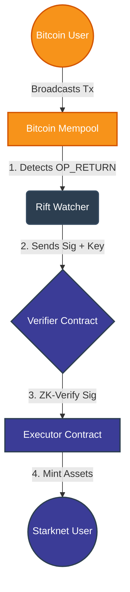

# 🏗️ Architecture

How Rift brings Bitcoin security to Starknet execution.

---

## 🔄 The Execution Flow

Rift eliminates latency by creating a "Fast Lane" for Bitcoin transactions.



*(Figure 1: The Watcher listens to the Mempool, extracts the signature, and proves validity on Starknet in sub-seconds.)*

---

## 🧩 Protocol Components

### 1. The Watcher (Python)

An off-chain agent that scans the Bitcoin Mempool.

| Attribute | Description |
|-----------|-------------|
| **Role** | Detective 🕵️ |
| **Location** | `watcher/watcher.py` |
| **Action** | Finds transactions with the `OP_RETURN "RIFT"` tag |
| **Output** | Extracts `public_key`, `signature`, and relays to Starknet |
| **Mode** | Mock (testing) or Live (Bitcoin Testnet RPC) |

**Key Features:**
- Polls Bitcoin mempool every 2 seconds
- Detects `OP_RETURN` transactions containing hex tag `0x52494654` ("RIFT")
- Extracts transaction hex and OP_RETURN data
- Serializes data to field elements (felts) for Cairo contract consumption

---

### 2. The Verifier (Cairo Contract)

The security heart of the protocol.

| Attribute | Description |
|-----------|-------------|
| **Role** | Judge ⚖️ |
| **Location** | `contracts/src/verifier.cairo` |
| **Cairo Version** | 2.6.4 (2023_11 edition) |
| **Pattern** | Interface-Implementation (`IVerifier` trait + `VerifierImpl`) |

#### Contract Architecture

The Verifier contract uses Cairo 2.6.4's modern **interface-implementation pattern**:

```cairo
// 1. Define the interface (trait)
#[starknet::interface]
pub trait IVerifier<TContractState> {
    fn is_verified(self: @TContractState, tx_hash: felt252) -> bool;
    fn verify_secp256k1_signature(ref self: TContractState, ...) -> bool;
    // ... more functions
}

// 2. Implement the interface
#[abi(embed_v0)]
impl VerifierImpl of super::IVerifier<ContractState> {
    fn is_verified(self: @ContractState, tx_hash: felt252) -> bool {
        self.verified_transactions.read(tx_hash)
    }
    // ... more implementations
}
```

#### Storage Structure

| Variable | Type | Purpose |
|----------|------|---------|
| `owner` | `ContractAddress` | Admin ownership control |
| `verified_transactions` | `Map<felt252, bool>` | Tracks verified transaction hashes |
| `verification_count` | `u64` | Total number of successful verifications |

#### Events

| Event | Fields | Purpose |
|-------|--------|---------|
| `SignatureVerified` | `tx_hash` (key), `public_key_x`, `verified` | Emitted on successful verification |

#### Signature Verification Status

| Status | Details |
|--------|---------|
| **Current Mode** | 🧪 Mock Verification |
| **Implementation** | `verify_secp256k1_signature()` returns `true` for valid inputs |
| **Purpose** | Enable end-to-end integration testing between Python Watcher and L2 state |
| **Next Phase** | Replace mock with native secp256k1 precompile syscalls |

> **Mock Mode Rationale:** The verification logic currently accepts valid signatures without cryptographic proof. This allows the team to:
> 1. Test the full Watcher → Verifier pipeline
> 2. Validate event emission and state changes
> 3. Debug integration issues before adding crypto complexity
>
> Native secp256k1 verification using Starknet precompiles will be phased in next.

#### Public Functions

| Function | Parameters | Returns | Purpose |
|----------|------------|---------|---------|
| `is_verified` | `tx_hash: felt252` | `bool` | Check if transaction was verified |
| `get_verification_count` | — | `u64` | Get total verification count |
| `get_owner` | — | `ContractAddress` | Get contract owner address |
| `transfer_ownership` | `new_owner: ContractAddress` | — | Transfer admin control |
| `verify_secp256k1_signature` | `tx_hash`, `public_key_x/y`, `msg_hash`, `r`, `s` | `bool` | Verify and record signature |

---

### 3. The Executor (L2 Contract)

The business logic layer.

| Attribute | Description |
|-----------|-------------|
| **Role** | Builder 🏗️ |
| **Status** | ⏳ Planned (Phase 3) |
| **Action** | Mints assets, updates game state, triggers DeFi swaps |

**Planned Features:**
- Mint wrapped Runes/Ordinals based on verified L1 transactions
- Update user balances instantly on L2
- Trigger conditional logic (swaps, gaming state, etc.)

---

## 🔐 Security Model

| Layer | Mechanism | Description |
|-------|-----------|-------------|
| **L1 (Bitcoin)** | ECDSA Signatures | Bitcoin transaction signatures prove user intent |
| **L2 (Starknet)** | ZK-STARK Proofs | Cairo programs generate proofs of correct execution |
| **Replay Prevention** | Storage Map | Verified transaction hashes are tracked to prevent double-spending |
| **Access Control** | Owner-only functions | Administrative functions restricted to contract owner |

---

## 📊 Data Flow Summary

```
┌─────────────────────────────────────────────────────────────┐
│ 1. Bitcoin User broadcasts Tx with OP_RETURN "RIFT" tag    │
└─────────────────────────────────────────────────────────────┘
                            │
                            ▼
┌─────────────────────────────────────────────────────────────┐
│ 2. Watcher detects Tx in mempool, extracts signature data  │
└─────────────────────────────────────────────────────────────┘
                            │
                            ▼
┌─────────────────────────────────────────────────────────────┐
│ 3. Watcher calls verify_secp256k1_signature() on Verifier  │
└─────────────────────────────────────────────────────────────┘
                            │
                            ▼
┌─────────────────────────────────────────────────────────────┐
│ 4. Verifier validates inputs, checks replay, stores result │
│    (Mock: accepts valid inputs | Future: crypto verify)    │
└─────────────────────────────────────────────────────────────┘
                            │
                            ▼
┌─────────────────────────────────────────────────────────────┐
│ 5. Verifier emits SignatureVerified event                  │
│ 6. Executor listens, mints assets on L2                     │
└─────────────────────────────────────────────────────────────┘
```
