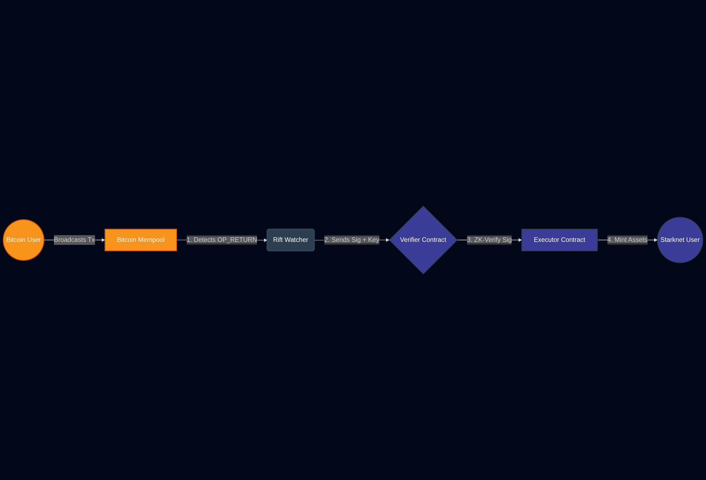

# 🏗️ Architecture

How Rift brings Bitcoin security to Starknet execution.

---

## 🔄 The Execution Flow

Rift eliminates latency by creating a "Fast Lane" for Bitcoin transactions. We verify the transaction **before** it is mined in a block.

*(Figure 1: The Rift Watcher listens to the Mempool, extracts the signature, and proves validity on Starknet in sub-seconds.)*

---

## 🧩 Protocol Components

> **💡 The Core Innovation**
> Most bridges wait for 6 blocks (60 mins). Rift verifies the **Signature** in the mempool (0 seconds), using ZK-proofs to handle the risk.

### 1. The Watcher (Python)
An off-chain agent that scans the Bitcoin Mempool.
* **Role:** Detective 🕵️
* **Action:** Finds transactions with the `OP_RETURN "RIFT"` tag.
* **Output:** Extracts the `public_key` and `signature` and sends them to Starknet.

### 2. The Verifier (Cairo Contract)
The security heart of the protocol.
* **Role:** Judge ⚖️
* **Tech:** Uses **Garaga** to verify cryptographic signatures (secp256k1).
* **Verdict:** If the signature is valid, it approves the transaction immediately.

### 3. The Executor (L2 Contract)
The business logic layer.
* **Role:** Builder 🏗️
* **Action:** Mints assets, updates game state, or triggers DeFi swaps instantly.
